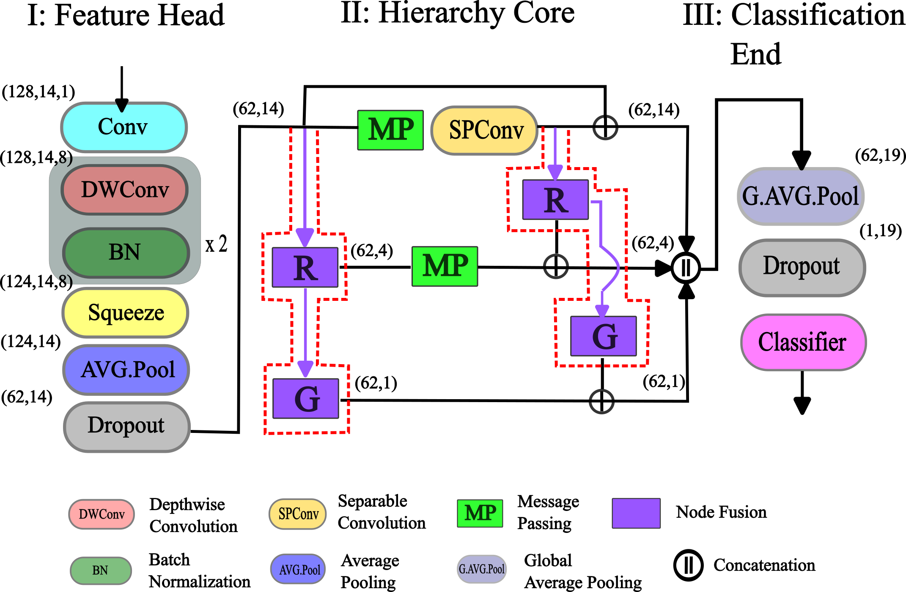
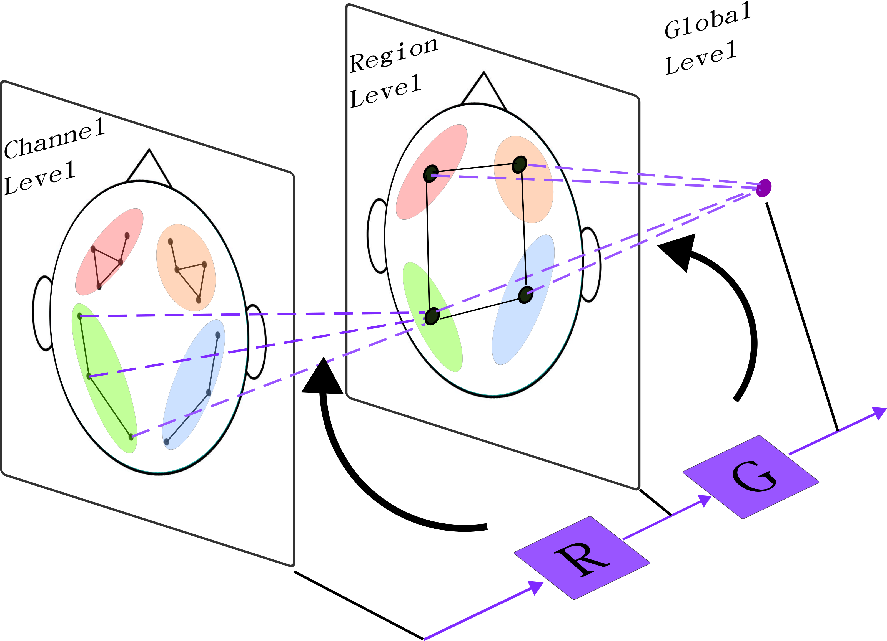
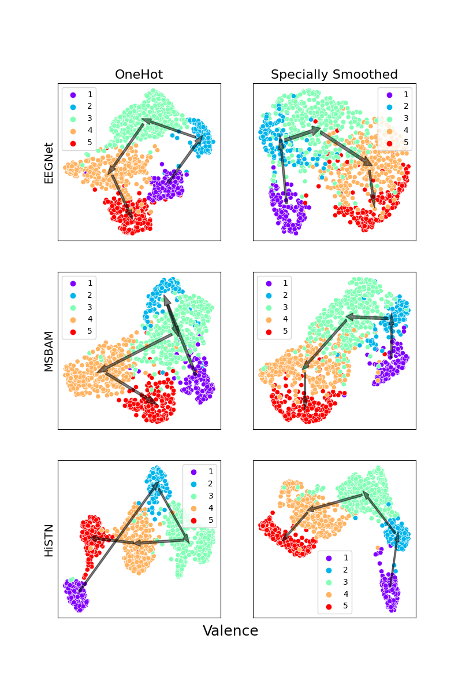
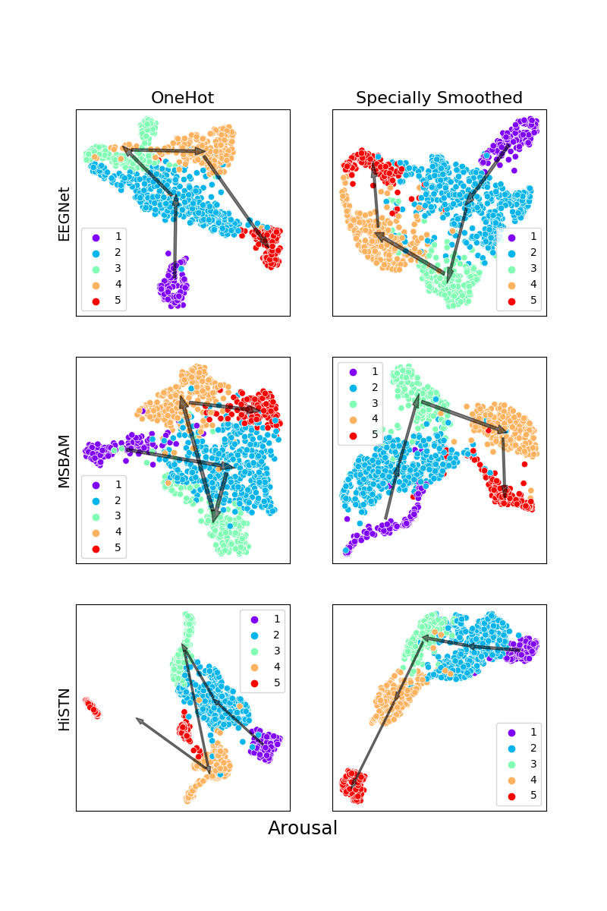

# EEG-based-affective-computing
A repo for exploring deep learning methods on EEG-based affective computing tasks.  

Current codes are accompanying our work in [...](...). A key design in our HiSTN framework for model's temporal-spatial hierarchy construction is illustrated as below:  

---

With the proposed spatially smoothed label encoding, models can learn a representation space 
with better qualitative behavior during training.   

  
### About Codes    

Experiments are performed under both subject-dependent and subject-independent settings for a rarely done 
5-classification task with [DREAMER Dataset](https://zenodo.org/record/546113).   

#### Network Designs  
`Modules.py`: Some custom layers/blocks for building network models.  
`Models.py`: Models for benchmarks.  

#### Training Scripts  
`Dreamer_10cv.py`: Python script for subject dependent experiments.  
`DREAMER_independent_1on1_formal_notransit.py`: Python script for subject independent experiments (Trained on one subject and predict on the next).   
`DREAMER_independent_reston1_formal_notransit.py`: Python script for subject independent experiments (Leave One Subject Out Cross Validation).  

The `*.sh` files are bash scripts for benchmarking different models via above python scripts.   

#### Evaluation and Visualizations  
The following scripts are for gathering relevant benchmark results and making plots for visulization.  
`SD_explore_plot.py`, `SI_1on1_explore_plot.py`, `SI_reston1_explore_plot.py`  

#### Other Supporting  Codes  
`Losses.py`: Some custom losses functions.  
`Metrics.py`: Some custom metrics for monitoring during training.  
`utils.py`: Some utility functions.  

